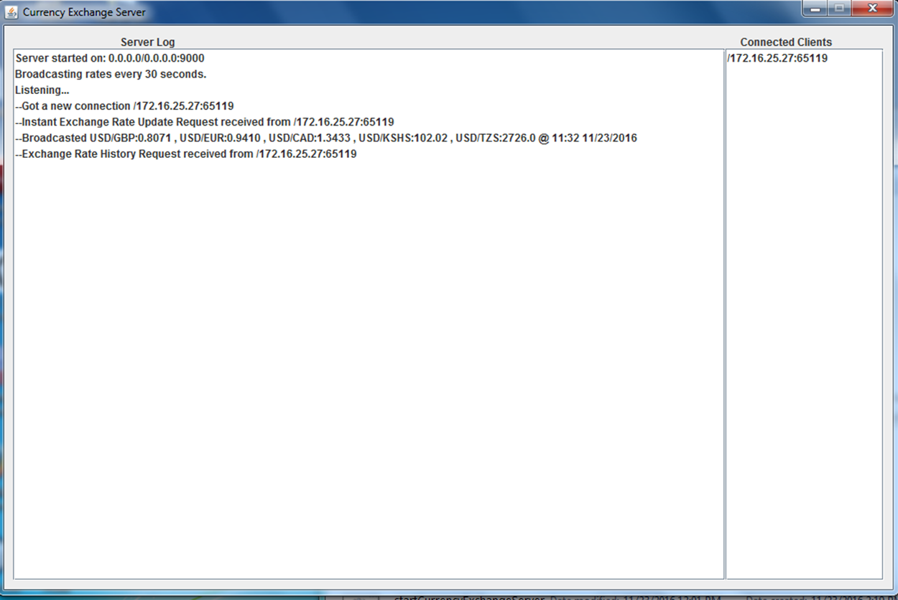
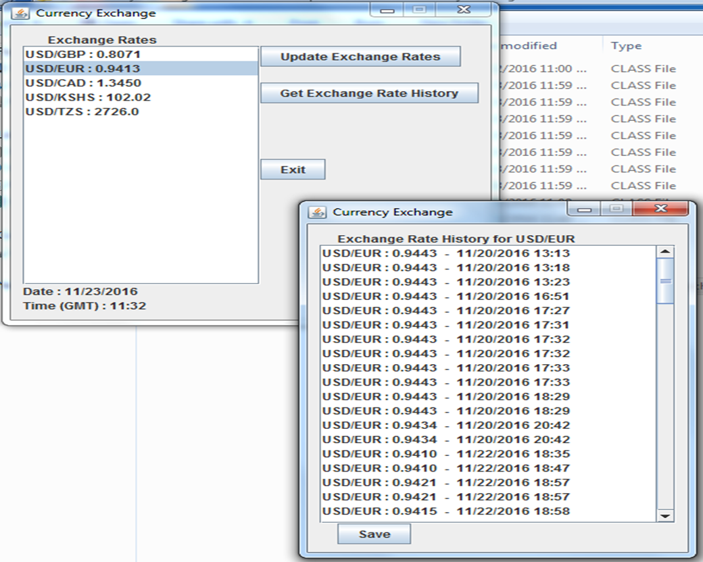

# Currency Exchange Broadcaster

This is a distributed system utilizing sockets to share information with users on the same network. The server retrieves and stores currency exchange rates from a web service and then broadcasts these new rates to all connected clients. Meanwhile, clients can also retrieve past exchange rates stored on the server.

By utlizing thus system you could reduce costs incurred when using multiple connections to expensive web services and stored records will be consistent and eliminate data redundancies.

### Dependencies
* Java version 8 or greater
* Sqlite JDBC

## How to use
Once you have the server and client programs compiled you need to follow these steps:

**Server:**
Start the server first. Enter a port number for the server and a time interval (in seconds) after which new rates will be retrieved.

**Client:**
Once the server is running you can start the client. Enter the IP address of the computer running the server and then enter the port the server is listening on.
Once done you should see a screen with select currency pair exchange rates and options to retrieve past records for any given currency pair.

### How to build
The system can be compiled using the standard java compiler. However, note that for the server you need to include the sqlite jdbc library.
